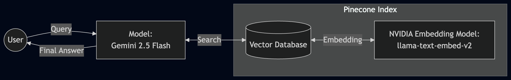

# Company Policy RAG Bot

An autonomous, agentic RAG system built with **LangGraph**, **Pinecone NVIDIA Inference**, and **Gemini 2.5**.

## 🏗️ System Architecture


## 🚀 Key Features
*   **Agentic Logic:** Uses `LangGraph` to dynamically route user queries. The agent intelligently decides when to call the retrieval tool and when to answer directly.
*   **Server-Side Inference:** Leverages **NVIDIA Llama-text-embed-v2** hosted directly on Pinecone, bypassing complex client-side embedding math and dimension mismatch issues.
*   **Persistent Memory:** Utilizes `MemorySaver` to track conversational context across multi-turn user sessions.
*   **Resilience:** Implements programmatic cool-down logic to handle API rate limits (429 errors) gracefully.

## 🛠️ Tech Stack
*   **Orchestration:** LangGraph
*   **LLM:** Gemini 2.5 Flash
*   **Vector Infrastructure:** Pinecone (Inference-Enabled Index)
*   **Embedding Model:** NVIDIA Llama-text-embed-v2
*   **Development:** Python 3.12+

## ⚙️ Quick Start

### 1. Environment Setup
Create a `.env` file in the root directory with your keys:
```text
GOOGLE_API_KEY=your_gemini_key_here
PINECONE_API_KEY=your_pinecone_key_here
